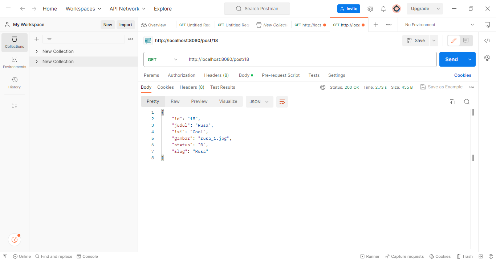
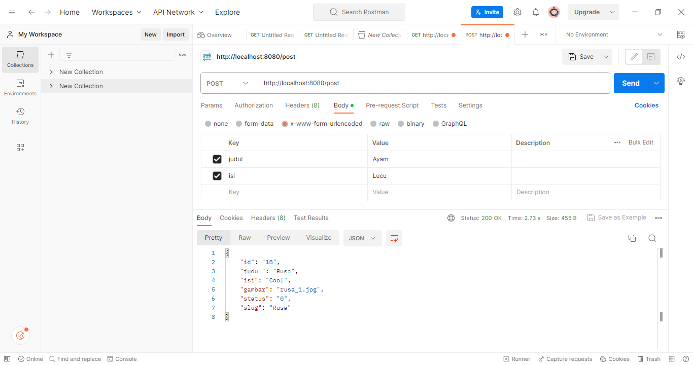
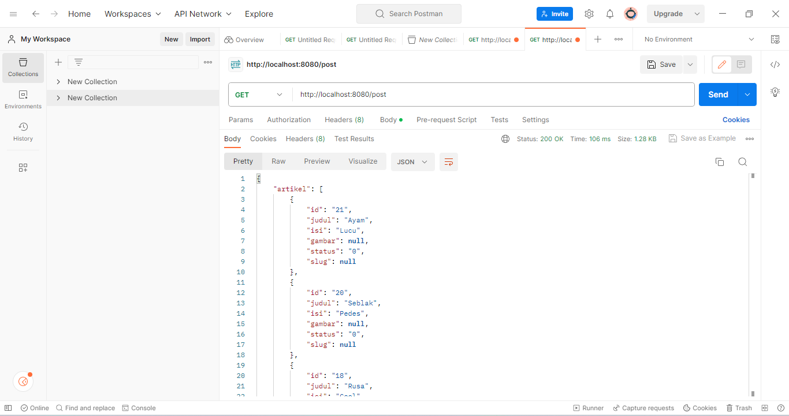
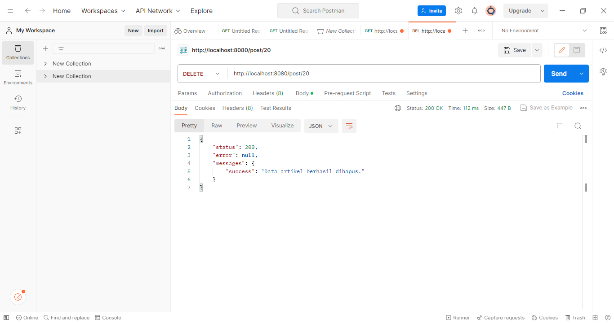

## Praktikum 12: API

Nama: Alvina Damayanti

Nim: 312110125

Kelas: TI.21.A.3

## Rest API

## Output

REST API berisi aturan untuk membuat web service dengan membatasi hak akses client yang mengakses API.

1. Menampilkan Semua Data dengan Method GET

2. Menampilkan Data Spesifik

- Mencari data dengan id 18

3. Mengubah Data dengan Method Put

- Tidak ada modelnya

4. Menambahkan Data dengan Method Post

- Menambah data dengan judul "Artikel Keempat" dengan mengisi value sesuai keinginan

- Tampilan saat melihat semua data dengan method get. Akan terlihat dengan id 21

5. Menghapus Data dengan Method Delete

- Menghapus data dengan id 20

- Tampilan saat melihat semua data dengan method get. Maka id 20 akan hilang/terhapus

